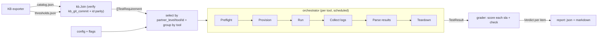

# Architecture

Authoritative decision: [ADR-0003](../decisions/0003-harness-architecture-ports-and-adapters.md).
This page is the working overview.

## Principles

- **Ports-and-adapters.** The core depends only on interfaces
  (`internal/stages`); it never imports a concrete tool.
- **Data-driven.** The KB export **v2.0 two-file contract** (ADR-0006) drives a
  run: `catalog.json` (publishable — per-Test-Requirement metadata + counts)
  says what exists; the runtime-supplied `thresholds.json` (sensitive) holds the
  SLA numbers + full check definitions. They join on TR id and must share
  `provenance.kb_git_commit`. Adding a *test requirement* is a KB export change;
  adding a *tool* is a new adapter bundle.
- **Run released images.** Tools run as the container images their projects
  publish; we compile only our adapter glue.

## Flow

## Stage interfaces (the layers)

`Preflight`, `Provisioner`, `Runner`, `LogCollector`, `ResultParser`,
`Teardown` — each small and independently testable. A `ToolIntegration` binds a
set of them plus `Image`, `Provides`, and optional custom `Evaluators`.

Every stage method takes `context.Context` (cancellation/timeout) and a
`*core.Bag` (concurrency-safe `string → any` state threaded stage-to-stage — the
namespace Provision made, the Job name Run produced, etc.). The Bag is
deliberately not `context.Value`.

## Evaluation

`ResultParser` emits a normalized `TestResult` keyed by TR id: `Metrics` (with
optional `Percentile`) feed SLA scoring, and `Checks` (checkID → tool-native
outcome) feed capability/suite/scenario checks. The grader scores a TR into
**one `Verdict` per scorable item**:

- **Each SLA** — find the measured metric by name (+ percentile if set); pass
  iff `measured <operator> value`. Skip when `sla_status == to-be-validated` or
  `value == null` (bar not set); error if the metric is missing.
- **Each check** — dispatch on `kind`. `capability`/`suite`/`scenario` read the
  tool's native outcome for the check id. `manual` and `status ==
  to-be-validated` skip (human sign-off / not yet automatable). The check's
  `expectation` is always surfaced in the verdict reason.
- A TR whose `automation_tool` is empty/`manual`/unregistered never runs — the
  orchestrator emits skip verdicts (not-scorable) before scheduling.
- A `ToolIntegration` may supply a custom `Evaluator` keyed by TR id that fully
  owns scoring for TRs that don't reduce to the built-in rules.

## Scheduling

`--concurrency N` bounds parallel tools. Per-tool `parallel_safe` and
`exclusivity_groups` constrain overlap: non-parallel-safe work runs alone; jobs
sharing an exclusivity group never overlap. These are **not** in the KB
contract — a `ToolIntegration` declares its defaults in code, and a plan's
`scheduling:` block overrides them per run (ADR-0006).

## Test plans and backends

Authoritative decision: [ADR-0005](../decisions/0005-test-plans-and-backend-config.md).
Both are hand-authored **YAML** (the KB-exported catalog/thresholds stay JSON).

- **Test plan** (`--plan`, examples in `plans/`) selects and parameterizes
  catalog TRs: `select` by ids / tools / partner_levels / `all`, optional per-TR
  `overrides` merged onto each TR's tool params, per-tool `scheduling` overrides,
  `concurrency`, and the active `backend`. The plan is the base; explicit CLI
  flags (`--tool/--id/--partner-level`, `--concurrency`, `--backend`) override
  it. Plans carry **no secrets**.
- **Backend** (`--backends` file + `--backend` name, or the plan's `backend`) is
  a named storage array: typed `vendor` / `storage_class` / `snapshot_class`, a
  free-form `params` map for vendor-specifics (e.g. Trident SVM / management LIF
  / endpoint; may be empty), and `secrets` given as **references** — a file
  path, a Kubernetes Secret ref, or an inline value (dev-only). Secrets resolve
  at run time into an in-memory `ResolvedBackend` (never logged or serialized)
  reachable by every stage via `RunCtx.Backend`. The backend is optional.

k8s Secret resolution is deferred until `internal/kube` (client-go) lands; such
refs error clearly until then.
