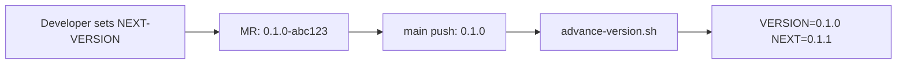

# CI/CD

Script-centric checks for **storage-cert-harness** ([ECOPROJECT-5274](https://redhat.atlassian.net/browse/ECOPROJECT-5274),
[ADR-0010](../decisions/0010-ci-scripts-and-multi-host.md),
[ADR-0011](../decisions/0011-harness-ships-as-container-image.md)). The same `ci/scripts/*.sh`
files run locally, in GitHub Actions, and via
pre-commit (yamllint, markdownlint, golangci-lint, secret-scan).

**Support status:** GitHub Actions is the only supported and maintained CI
provider. GitLab CI is no longer supported.

**`unittest.sh`** (`make unittest`) runs unit tests only (`go test ./...`:
package tests and golden-file parser tests). It does not need a cluster.
`make lint` / `make test` provide the corresponding local checks.
Offline CLI smoke is `replay-smoke.sh`. Live 3-VM boot-storm is a follow-up
(see Open items).

The GitHub Actions `supply-chain` job is gating: a failure fails the workflow.

## Layout

```text
ci/
  scripts/    # portable job logic
    ci-utils.sh          # shared helpers (REPO_ROOT, version funcs, container_engine)
    images.sh            # load ci/config/images.env, derive tool refs
    build.sh             # bin/harness (binary_version ldflags)
    image-build.sh       # linux/amd64 container → dist/harness-image.tar
    image-contents-check.sh  # verify harness + kubectl + virtctl + tool binaries
    layout-check.sh      # verify ci/scripts + ci/config + version files
    set-next-version.sh  # human-driven version bumps
    advance-version.sh   # CI auto-advance on main push
    lint-actions.sh      # actionlint wrapper for .github/workflows/*.yml
    ...                  # lint-*.sh, unittest.sh, secret-scan.sh, etc.
  config/     # linters, pins, allowlists
    images.env           # pinned CI images and tool versions (single source of truth)
    images.yml           # generated image configuration
    golangci.yml         # golangci-lint config
    yamllint.yaml        # yamllint config
    markdownlint-cli2.jsonc  # markdownlint-cli2 config (includes MD rule overrides)
    markdownlint.yaml    # markdownlint fallback config
    trivyignore          # accepted CVEs for Trivy
    secret-scan-allowlist.txt  # unused since ADR-0017 (numeric scan removed)
VERSION / NEXT-VERSION               # harness binary semver
IMAGE-VERSION / NEXT-IMAGE-VERSION   # container image tag semver
```

## Wrappers and scripts

```mermaid
flowchart TB
  subgraph wrappers [Thin wrappers]
    Local["make ci / ./ci/scripts/ci.sh"]
    PreCommit["pre-commit: yaml + md + go + secret-scan + version-lock"]
    GHA[".github/workflows/ci.yml"]
  end
  subgraph scripts [ci/scripts/]
    LintYaml["lint-yaml.sh"]
    LintActions["lint-actions.sh"]
    LintMd["lint-md.sh"]
    LintGo["lint-go.sh"]
    Unittest["unittest.sh"]
    Secret["secret-scan.sh"]
    Supply["supply-chain.sh"]
    Build["build.sh"]
    Replay["replay-smoke.sh"]
    Image["image-build.sh"]
    ImageCheck["image-contents-check.sh"]
    ImageLint["image-lint.sh"]
    ImageTrivy["image-scan-trivy.sh"]
    ImageDive["image-scan-dive.sh"]
  end
  Local --> LintYaml
  Local --> LintMd
  Local --> LintGo
  Local --> Unittest
  Local --> Secret
  Local --> Supply
  Local --> Build
  Local --> Replay
  Local --> Image
  Local --> ImageCheck
  Local --> ImageLint
  Local --> ImageTrivy
  Local --> ImageDive
  PreCommit --> LintYaml
  GHA --> LintActions
  PreCommit --> LintMd
  PreCommit --> LintGo
  PreCommit --> Secret
  GHA --> LintYaml
  GHA --> LintMd
  GHA --> LintGo
  GHA --> Unittest
  GHA --> Secret
  GHA --> Supply
  GHA --> Build
  GHA --> Image
  GHA --> ImageCheck
```



Offline Go: `GOPROXY=off` and `GOFLAGS=-mod=vendor`. Commit `vendor/`.
`go install` of govulncheck in the supply-chain job must set `GOFLAGS=`
(empty) so the proxy can be queried; that binary is not in `vendor/`.
gosec is the GitHub **release binary** (`GOSEC_VERSION`); do not `go install`
it in CI — compiling it pulls AI SDKs and OOM-kills CEE pods.

`go mod verify` / `go mod vendor` need a populated module cache. A cold cache
fails with `module lookup disabled by GOPROXY=off` before govulncheck runs.
`supply-chain.sh` logs each step; under `GOPROXY=off` it continues from
committed `vendor/` when verify/vendor cannot run. Integrity on CEE is
`vendor/` + `go list -mod=vendor`. To force verify locally:
`GOPROXY=https://proxy.golang.org,direct ./ci/scripts/supply-chain.sh`.

## Versioning

Two independent semver tracks at the repo root. Each file contains a single
`MAJOR.MINOR.PATCH` line (no `v` prefix):

| File | Purpose |
|------|---------|
| `VERSION` | Last harness **binary** released from main (starts `0.0.0`) |
| `NEXT-VERSION` | Next binary version (starts `0.1.0`) |
| `IMAGE-VERSION` | Last **container image** released from main (starts `0.0.0`) |
| `NEXT-IMAGE-VERSION` | Next image version (starts `0.1.0`) |

The tracks may diverge (binary `1.2.0` inside image tagged `3.0.0`).
`harness version` is always the **binary** track. The Quay tag and OCI label
`org.opencontainers.image.version` are always the **image** track.

### Computed version strings (`ci-utils.sh`)

| Helper | Local / PR | CI push to `main` |
|--------|-----------------|-------------------|
| `binary_version()` | `$(cat NEXT-VERSION)-$(git_sha)` | `$(cat NEXT-VERSION)` |
| `image_version()` | `$(cat NEXT-IMAGE-VERSION)-$(git_sha)` | `$(cat NEXT-IMAGE-VERSION)` |

Process-only overrides (do not write files):
`HARNESS_VERSION` → binary; `HARNESS_IMAGE_VERSION` → image tag.

`is_main_push`: GitHub `$GITHUB_REF == refs/heads/main &&
$GITHUB_EVENT_NAME == push`.
Local checkout of main still gets `-sha`.

### Wiring

- `build.sh`: `-X main.version=$(binary_version)` → `dist/binary-version.txt`
- `build` publishes `bin/harness` as the `harness-binary` CI artifact. The
  image job downloads that artifact before running `image-build.sh`; image
  construction does not compile Go.
- `image-build.sh`: `--build-arg HARNESS_VERSION=$(binary_version)` (binary
  supplied by the build artifact),
  `--build-arg IMAGE_VERSION=$(image_version)` (OCI label),
  tag `${QUAY_IMAGE}:$(image_version)`, `:main`, and `:latest` on main push.
  Write `dist/image-version.txt`.

### Version flow



### Advance (main only, after a successful image push)

`advance-version.sh` — one commit for both tracks so a failed image does not
consume either number:

1. `VERSION :=` current `NEXT-VERSION`; `NEXT-VERSION` patch + 1
2. `IMAGE-VERSION :=` current `NEXT-IMAGE-VERSION`; `NEXT-IMAGE-VERSION` patch + 1
3. Stage all four files and set `ALLOW_VERSION_CHANGE=1`. GitHub passes the
  staged changes to its automated version-bump pull request.

Refuses unless `is_main_push` and each NEXT is valid semver greater than its
released counterpart.

### Bootstrap, lock, and setting one track

Pre-commit hook `version-files-locked` blocks staged changes to the four
version files unless `ALLOW_VERSION_CHANGE=1` or `GITHUB_ACTIONS` is set. On
failure, it prints the commands below. Never use `--no-verify`.

**Initial (both tracks):**

```sh
./ci/scripts/set-next-version.sh --init 0.1.0 0.1.0   # binary then image
ALLOW_VERSION_CHANGE=1 git add VERSION NEXT-VERSION IMAGE-VERSION NEXT-IMAGE-VERSION
ALLOW_VERSION_CHANGE=1 git commit -m "chore: initial binary 0.1.0 image 0.1.0"
```

**Later — one track only:**

```sh
./ci/scripts/set-next-version.sh --binary 1.0.0
./ci/scripts/set-next-version.sh --image 2.0.0
# make set-next-version BINARY=1.0.0
# make set-next-version IMAGE=2.0.0
ALLOW_VERSION_CHANGE=1 git add NEXT-VERSION          # or NEXT-IMAGE-VERSION
ALLOW_VERSION_CHANGE=1 git commit -m "chore: set next binary version to 1.0.0"
```

**One-off local:**

```sh
HARNESS_VERSION=1.0.0-local ./ci/scripts/build.sh
HARNESS_IMAGE_VERSION=2.0.0-local ./ci/scripts/image-build.sh
```

**Not supported:** editing the released `VERSION` / `IMAGE-VERSION` files by
hand (CI-owned after bootstrap); `-rc` in the NEXT files.

GitHub's `version-bump` job has `contents: write` and `pull-requests: write`.
It runs `advance-version.sh` with `VERSION_BUMP_PR=1`, which stages the four
files without committing. `peter-evans/create-pull-request` creates or updates
`chore/version-bump` against `main`, then `gh pr review` approves it using the
`ADMIN_PAT_TOKEN` secret and `gh pr merge --auto --squash` queues the merge using
the workflow's `GITHUB_TOKEN`. The PR is merged only after branch protection
requirements pass.

## GitHub Actions

`.github/workflows/ci.yml` orchestrates six ordered reusable workflows:
`ci-linters.yml`, `ci-tests.yml`, `ci-build.yml`, `ci-smoke.yml`,
`ci-images.yml`, and `ci-publish.yml`. The stages run in order as
linters -> tests -> build -> image build -> image push/version bump.
`ci-smoke.yml` remains **skipped by default** (opt-in via repository variables).
The Trivy/Dive jobs inside `ci-images.yml` run with the image build and are
non-blocking; they are not CI gates. The linter workflow
installs a pinned `actionlint` release and validates all
`.github/workflows/*.yml` files. The build and image workflows pass the
`harness-binary` and `harness-image` artifacts to later stages.

On a successful `main` publish, the `version-bump` job creates the automated
version-bump PR. The shared `advance-version.sh` script configures the
`github-actions[bot]` identity when running in GitHub Actions; local runs
preserve the developer's Git identity. The resulting commit is not
cryptographically signed by the current CI setup.

The top-level workflow dispatch input is:

| Input | Purpose | Default |
|-------|---------|---------|
| `publish` | Enable image push and version advancement after the checks pass | `false` |

**Publish gates (GitHub).** On a push to `main`, `image-push` runs when
`image-build` succeeds. `replay-smoke`, `image-scan-trivy`, and
`image-scan-dive` run with allowed failures and do not gate publish. A manual
`workflow_dispatch` with `publish=true` can also push from `main`. A `test-ci`
push cannot publish an image or advance version files.

**Image lint and scans.**

| Where | `image-lint` | `image-scan-trivy` / `image-scan-dive` |
|-------|--------------|----------------------------------------|
| GitHub Actions | Before `image-build`; `continue-on-error: true` | Run after image build; failures are allowed |
| Local | `make image-lint` | `make image-scan` / `make ci-image` |

Optional GitHub repository variable (unset by default): `CI_RUN_REPLAY_SMOKE` set
to `true` to run the smoke job for debugging. The image lint and image scans run
by default and remain non-gating.

Run the Containerfile lint locally with `make image-lint`. It uses the pinned
Hadolint image from `CI_TOOLS_IMAGE` and reports any privileged `USER 0` setup
lines for context. The Containerfile ends each stage as non-root and Hadolint
is clean. Run image scans locally with
`make image-build && make image-scan`.
Trivy writes `dist/trivy-report.json` and `dist/trivy-report.txt`; Dive writes
`dist/dive-report.txt`. GitHub runs the scan jobs with failures allowed, so
logs and reports are available as job artifacts; it produces no Code scanning
(SARIF) upload. Local `dist/` output remains available via `make image-scan`.

The `secret-scan` job uses `fetch-depth: 0` so its merge-base diff scan can
inspect the complete history.

## Image contents

The release image is `linux/amd64` only. It covers x86 hosts natively, Intel
Macs natively, and Apple Silicon via Docker/Podman Desktop Rosetta 2.

| Binary | Purpose | Install method |
|--------|---------|----------------|
| `harness` | CLI (this repo) | Go build from source |
| `kube-burner` | TR-VIRT-010 adapter | GitHub release tarball (`KUBE_BURNER_VERSION`) |
| `kube-burner-ocp` | TR-STOR-006 adapter | GitHub release tarball (`KUBE_BURNER_OCP_VERSION`) |
| `virtbench` | virtbench adapter local-exec | Pinned `VIRTBENCH_VERSION` |

All three must be on `PATH` under `/usr/bin/`. Pins live in
`ci/config/images.env`. `image-contents-check.sh` verifies each binary is
present and runnable after every image build (locally and in CI).

In the supported GitHub Actions flow, `image-push` runs automatically on
`main` pushes. `supply-chain` is gating.

## Job images (no Docker Hub)

Pins live in **`ci/config/images.env`**. Shell scripts source
`ci/scripts/images.sh` via `ci/scripts/ci-utils.sh` or `install-tools.sh`.
After editing the env file, run `./ci/scripts/sync-images-yml.sh`; the
generated projection is retained for repository compatibility.

| Job | Pin (`ci/config/images.env`) |
| --- | --- |
| lint-yaml | `YAML_LINT_IMAGE` |
| lint-md | `MD_LINT_IMAGE` |
| lint-go, unittest, secret-scan, supply-chain, replay-smoke, build | `BUILD_IMAGE` |
| image-build | `BUILDAH_IMAGE` |
| image-scan-trivy | `BUILD_IMAGE` + Trivy release binary (`TRIVY_VERSION`) |
| image-scan-dive | `BUILD_IMAGE` + Dive release binary (`DIVE_VERSION`) |

`ubi9/go-toolset` only goes to Go 1.25; this module is **1.26**, so `BUILD_IMAGE`
is ubi10, pinned at `1.26.7-*` (Go **1.26.7+**), not `:latest`. `YAML_LINT_IMAGE` and `MD_LINT_IMAGE` use
the UBI **minor stream** (`:9.8` / `:9.7`), not `:latest` and not a rebuild
id. golangci-lint is still the GitHub **release tarball**
(`GOLANGCI_LINT_VERSION`) into `$(go env GOPATH)/bin` (go-toolset is
non-root; `/usr/local/bin` is not writable).

### Populating `quay.io/virtarraycert/ci_tools`

That repo is **public and starts empty**. Trivy/Dive jobs cannot run until
someone retags the pinned Hub images from a machine that *can* pull Hub and
push to Quay ([ECOPROJECT-5411](https://redhat.atlassian.net/browse/ECOPROJECT-5411)):

```sh
podman login quay.io
make mirror-ci-tools          # or PUSH=0 ./ci/scripts/mirror-ci-tools.sh to tag only
```

Tags come from `TRIVY_VERSION` / `DIVE_VERSION` in `ci/config/images.env`
(`trivy-<version>`, `dive-<tag>`).

## Local tools

Install once (idempotent). Requires Go 1.26.7+, git, python3, pip, and npm
already on `PATH`. Tool versions are pinned in `ci/config/images.env`.

```sh
./ci/scripts/install-tools.sh          # install anything missing
./ci/scripts/install-tools.sh --check  # print status only
make install-tools
```

Put `$(go env GOPATH)/bin` **before** `/usr/local/bin` on `PATH`. Pins match
`ci/config/images.env`: golangci-lint is a GitHub release binary installed
into `BUILD_IMAGE` (not the Docker Hub `golangci/golangci-lint` image). That
golangci-lint build needs Go 1.26.7+ because `go.mod` is 1.26.7.

| Tool | Scripts | Installed by |
| ------ | --------- | -------------- |
| **podman** | `image-build.sh`, `image-push.sh` | OS package (`dnf`/`apt`). Default engine. |
| `yamllint` | `lint-yaml.sh` | `pip install --user yamllint` |
| `markdownlint-cli2` | `lint-md.sh` | `npm install -g --prefix ~/.local` |
| `golangci-lint` | `lint-go.sh` | GitHub release tarball (CI: `BUILD_IMAGE` → `GOPATH/bin`; local: `~/.local/bin`). Not Docker Hub. |
| `govulncheck` | `supply-chain.sh` | `go install …@latest` |
| `gosec` | `supply-chain.sh` | GitHub release tarball (`GOSEC_VERSION`). Not `go install`. |
| `trivy` | `supply-chain.sh`, `image-scan-trivy.sh` | GitHub release tarball → `~/.local/bin` |
| `dive` | `image-scan-dive.sh` | GitHub release tarball → `~/.local/bin` |
| `hadolint` | `image-lint.sh` | GitHub release binary (`HADOLINT_VERSION`) → `~/.local/bin` |
| `go`, `git`, `gofmt` | `lint-go.sh`, `unittest.sh`, `build.sh`, … | not installed here |

Optional: `gitleaks` (secret-scan), `pre-commit` (yamllint + markdownlint +
golangci-lint + secret-scan + version-lock). Hadolint runs from the pinned
`HADOLINT_VERSION` release binary locally and from the pinned `CI_TOOLS_IMAGE`
container in CI through `image-lint.sh`; it is not part of the Trivy scan.
GitHub Actions image jobs and local runs use Podman via
`CONTAINER_ENGINE=podman`. Override it only when needed with
`CONTAINER_ENGINE=docker` or `CONTAINER_ENGINE=buildah`.

## Local

```sh
pre-commit install          # yaml + md + go + secret-scan + version-lock → logs/pre-commit-*.log
./ci/scripts/install-tools.sh       # one-time: yamllint, markdownlint, golangci-lint, …
make lint                   # lint-yaml (+ layout-check), lint-md, lint-go
make lint-actions           # actionlint for GitHub Actions workflows
make test                   # unittest, secret-scan, supply-chain
make build                  # bin/harness + dist/binary-version.txt
make unittest               # go test ./... only
./ci/scripts/ci.sh          # lint + test stages, then replay-smoke
./ci/scripts/ci.sh --image  # also build + contents-check + Trivy + Dive with podman (sequential)
make ci-image               # same as ci.sh --image
make image-lint             # Hadolint Containerfile check (non-gating in CI)
make image-scan-trivy       # Trivy only (after make image-build)
make image-scan-dive        # Dive only
make set-next-version BINARY=1.0.0   # set next binary version (see Versioning)
make set-next-version IMAGE=2.0.0    # set next image version
```

Hooks run only when staged files match `.pre-commit-config.yaml` (`files:`).
The GitHub Actions `supply-chain` job is gating.

Logs: [`logs/`](../logs/README.md) (gitignored except `logs/README.md`). GitHub
uploads `logs/*.log` when a job fails (not the README).

## Scripts

| Script | Role |
| -------- | ------ |
| `install-tools.sh` | Local install of lint/scan tools + podman (idempotent; `--check`) |
| `ci-utils.sh` | Shared helpers: `REPO_ROOT`, `CI_SCRIPTS_DIR`, `CI_CONFIG_DIR`, version functions, `container_engine`, logging |
| `images.sh` | Load `ci/config/images.env`, derive tool refs |
| `sync-images-yml.sh` | Project `images.env` → generated `images.yml`; `--check` from lint-yaml |
| `layout-check.sh` | Verify reorder layout: scripts, configs, version files, no leftovers |
| `lint-yaml.sh` | yamllint + images.yml/Containerfile pin check + layout-check |
| `lint-actions.sh` | actionlint validation for `.github/workflows/*.yml` |
| `lint-md.sh` | markdownlint-cli2 (config from `ci/config/markdownlint-cli2.jsonc`) |
| `lint-go.sh` | gofmt, go vet, golangci-lint (config from `ci/config/golangci.yml`) |
| `unittest.sh` | **Unit tests only** (`go test ./...`). |
| `build.sh` | `bin/harness` with `binary_version()` ldflags |
| `secret-scan.sh` | tracked reports (`report.json`/`.md`); editor/workspace tokens; gitleaks |
| `supply-chain.sh` | vendor/`go list`, govulncheck, gosec, `trivy fs`. **Gating on GitHub Actions.** |
| `replay-smoke.sh` | `harness validate` + `run` with example catalog/plan (no cluster). GitHub: skipped (opt-in via `CI_RUN_REPLAY_SMOKE`). |
| `image-build.sh` | `linux/amd64` Containerfile → `dist/harness-image.tar` (no push). Local: **podman**. |
| `image-contents-check.sh` | Verify `harness`, `kube-burner`, `kubectl`, `virtctl`, `kube-burner-ocp`, and `virtbench` are in the image |
| `image-lint.sh` | Hadolint Containerfile check from the pinned `CI_TOOLS_IMAGE`; reports privileged `USER 0` setup context. |
| `image-scan-trivy.sh` | Trivy HIGH/CRITICAL `--ignore-unfixed`, secrets, misconfig, CycloneDX SBOM. |
| `image-scan-dive.sh` | `CI=true dive` (wasted layers). |
| `image-push.sh` | Quay push; requires `PUSH=1`. GitHub: **automatic** on `main` push (or `workflow_dispatch` with `publish=true`). |
| `mirror-ci-tools.sh` | Retag Trivy/Dive/Hadolint into `quay.io/virtarraycert/ci_tools`; run locally with Quay push access. |
| `set-next-version.sh` | Set next binary/image version (`--binary`, `--image`, `--init`, `--self-test`) |
| `advance-version.sh` | Auto-advance both tracks on main push (CI only) |

The **release artifact** is that image ([ADR-0011](../decisions/0011-harness-ships-as-container-image.md)),
not the `bin/harness` binary. Registry:
`quay.io/eco-special-projects/storage-cert-harness:<image_version>` and `:main` on the
default branch. The `build` job produces `bin/harness` as a debug/dev artifact.

On **GitHub**, `image-lint` runs before `image-build` with
`continue-on-error: true`; Trivy and Dive run after the build with
`continue-on-error: true`. Run `make image-lint` or `make image-scan` locally
for the corresponding checks and report paths.

## Secret scan

SLA thresholds are public (ADR-0017), so the scan no longer refuses
`thresholds.json` or hunts for SLA-like numeric literals in code/plans/fixtures.
It now has two gates:

- **Tracked reports:** fails if git would contain a harness `report.json` /
  `report.md` (they can carry graded numbers).
- **Editor/workspace tokens:** fails on tracked VS Code / `*.code-workspace` /
  `.cursor` / `.devcontainer` / `.env` files with API key or token env vars
  holding real-looking values (`glpat-`, `ghp_`, `sk-`, `AKIA`, JWT, …).

If installed, `gitleaks` also runs over the working tree.

## Testing

### Local test execution flow

```sh
./ci/scripts/install-tools.sh
make lint          # layout-check via lint-yaml
make test
make build         # bin/harness + version assert
make ci            # lint + test + build + replay-smoke
make ci-image      # image-build (linux/amd64 + contents-check) + trivy + dive
```

Scratch/logs stay gitignored (`/bin/`, `/dist/`, `/logs/**`, `/ci-local/`).
Self-tests use `mktemp`.

On GitHub, `image-lint`, `image-scan-trivy`, and `image-scan-dive` run with
`continue-on-error: true` and do not block publish. `image-lint` completes
before `image-build`.

### GitHub `main` pipeline (publish)

| Job | When | Asserts |
|-----|------|---------|
| `image-build` | every `main` push | `linux/amd64` tar uploaded as `harness-image` artifact |
| `image-push` | after `image-build` succeeds | `image-push.sh` with `PUSH=1` → Quay (`:<version>-amd64`, `:<version>`, `:main`, `:latest`) |
| `version-bump` | after `image-push` succeeds | `advance-version.sh` → automated PR on `chore/version-bump` |

`image-push` is **automatic** on `main` pushes. A `workflow_dispatch` with
`publish=true` can also trigger push and version bump without a new commit.
Neither MR/PR runs nor `test-ci` pushes publish an image.

## Open items

### Supply-chain job

GitHub Actions fails the workflow when `supply-chain` fails.

### Replay-smoke job

GitHub skips the `smoke` job unless `vars.CI_RUN_REPLAY_SMOKE=true`; image build
and publish do not depend on it. Run `./ci/scripts/replay-smoke.sh` locally
when needed.

### Image lint and scan jobs (non-blocking)

GitHub runs `image-lint` before `image-build`, then both image scans, with
`continue-on-error: true`; `image-build` alone gates `publish`. GitHub lint and
scan logs and reports are uploaded as job artifacts, but no Code scanning
(SARIF) results are produced. Use `make image-lint` or
`make image-build && make image-scan` locally when you need the corresponding
output.

### Dedicated CI cluster (live smoke)

Today's jobs use hosted GitHub runners (no cluster). A later live-smoke job
should use GitHub environment secrets for `CI_CLUSTER_KUBECONFIG` and
`HARNESS_THRESHOLDS_JSON`. Never echo them (`set +x`); write kubeconfig to a
`0600` temp file and delete it in `trap`. Do not artifact full graded reports
that contain real SLA bars. Track follow-up as ECOPROJECT-5331 (or a new issue)
once `internal/kube` and virtbench exist.

### AI agent files must not go to public GitHub

`AGENTS.md`, `CLAUDE.md`, and `skills/` are AI instruction surfaces. On a public
mirror they can be edited to mis-instruct agents. They stay on **internal
GitLab**. `.gitattributes` marks them `export-ignore`. GitHub migration must
publish a tree **without** those paths and fail CI if they reappear. Public
contributors use this file, [contributing.md](contributing.md), and
[adapter-authoring.md](adapter-authoring.md).
