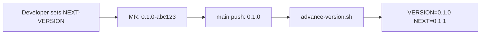
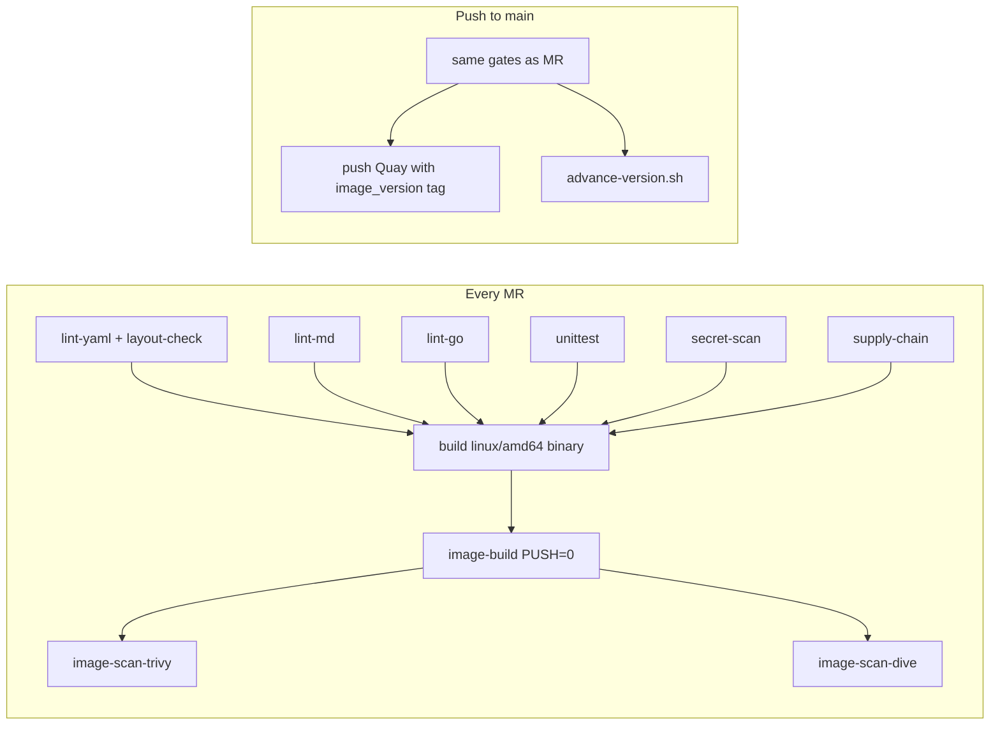

# CI/CD

Script-centric checks for **storage-cert-harness** ([ECOPROJECT-5274](https://redhat.atlassian.net/browse/ECOPROJECT-5274),
[ADR-0010](../decisions/0010-ci-scripts-and-multi-host.md),
[ADR-0011](../decisions/0011-harness-ships-as-container-image.md)). The same `ci/scripts/*.sh`
files run locally, in GitLab CI, in GitHub Actions, and via
pre-commit (yamllint, markdownlint, golangci-lint, secret-scan).

**`unittest.sh`** (`make unittest`) runs unit tests only (`go test ./...`:
package tests and golden-file parser tests). It does not need a cluster.
`make lint` / `make test` match the GitLab **lint** and **test** stages.
Offline CLI smoke is `replay-smoke.sh`. Live 3-VM boot-storm is a follow-up
(see Open items).

## Layout

```text
ci/
  scripts/    # portable job logic
    ci-utils.sh          # shared helpers (REPO_ROOT, version funcs, container_engine)
    images.sh            # load ci/config/images.env, derive Trivy/Dive refs
    build.sh             # bin/harness (binary_version ldflags)
    image-build.sh       # linux/amd64 container → dist/harness-image.tar
    image-contents-check.sh  # verify harness + kube-burner-ocp + virtbench
    layout-check.sh      # verify ci/scripts + ci/config + version files
    set-next-version.sh  # human-driven version bumps
    advance-version.sh   # CI auto-advance on main push
    ...                  # lint-*.sh, unittest.sh, secret-scan.sh, etc.
  config/     # linters, pins, allowlists
    images.env           # pinned CI images and tool versions (single source of truth)
    images.yml           # generated YAML projection for GitLab include:
    golangci.yml         # golangci-lint config
    yamllint.yaml        # yamllint config
    markdownlint-cli2.jsonc  # markdownlint-cli2 config (includes MD rule overrides)
    markdownlint.yaml    # markdownlint fallback config
    trivyignore          # accepted CVEs for Trivy
    secret-scan-allowlist.txt  # exact-line false-positive overrides
VERSION / NEXT-VERSION               # harness binary semver
IMAGE-VERSION / NEXT-IMAGE-VERSION   # container image tag semver
```

## Wrappers and scripts

```mermaid
flowchart TB
  subgraph wrappers [Thin wrappers]
    Local["make ci / ./ci/scripts/ci.sh"]
    PreCommit["pre-commit: yaml + md + go + secret-scan + version-lock"]
    GitLab[".gitlab-ci.yml"]
    GHA[".github/workflows/ci.yml"]
  end
  subgraph scripts [ci/scripts/]
    LintYaml["lint-yaml.sh"]
    LintMd["lint-md.sh"]
    LintGo["lint-go.sh"]
    Unittest["unittest.sh"]
    Secret["secret-scan.sh"]
    Supply["supply-chain.sh"]
    Build["build.sh"]
    Replay["replay-smoke.sh"]
    Image["image-build.sh"]
    ImageCheck["image-contents-check.sh"]
    ImageTrivy["image-scan-trivy.sh"]
    ImageDive["image-scan-dive.sh"]
  end
  Local --> LintYaml
  Local --> LintMd
  Local --> LintGo
  Local --> Unittest
  Local --> Secret
  Local --> Supply
  Local --> Build
  Local --> Replay
  Local --> Image
  Local --> ImageCheck
  Local --> ImageTrivy
  Local --> ImageDive
  PreCommit --> LintYaml
  PreCommit --> LintMd
  PreCommit --> LintGo
  PreCommit --> Secret
  GitLab --> LintYaml
  GitLab --> LintMd
  GitLab --> LintGo
  GitLab --> Unittest
  GitLab --> Secret
  GitLab --> Supply
  GitLab --> Build
  GitLab --> Replay
  GitLab --> Image
  GitLab --> ImageCheck
  GitLab --> ImageTrivy
  GitLab --> ImageDive
  GHA --> LintYaml
  GHA --> LintMd
  GHA --> LintGo
  GHA --> Unittest
  GHA --> Secret
  GHA --> Supply
  GHA --> Build
  GHA --> Replay
  GHA --> Image
  GHA --> ImageCheck
  GHA --> ImageTrivy
  GHA --> ImageDive
```



Offline Go: `GOPROXY=off` and `GOFLAGS=-mod=vendor`. Commit `vendor/`.
`go install` of govulncheck in the supply-chain job must set `GOFLAGS=`
(empty) so the proxy can be queried; that binary is not in `vendor/`.
gosec is the GitHub **release binary** (`GOSEC_VERSION`); do not `go install`
it in CI — compiling it pulls AI SDKs and OOM-kills CEE pods.

`go mod verify` / `go mod vendor` need a populated module cache. GitLab
jobs are cold (`GOMODCACHE` empty), so those commands fail with
`module lookup disabled by GOPROXY=off` and never reach govulncheck.
A laptop with a warm cache succeeds — same script, different cache.
`supply-chain.sh` logs each step; under `GOPROXY=off` it continues from
committed `vendor/` when verify/vendor cannot run. Integrity on CEE is
`vendor/` + `go list -mod=vendor`. To force verify locally:
`GOPROXY=https://proxy.golang.org,direct ./ci/scripts/supply-chain.sh`.

## Versioning

Two independent semver tracks at the repo root. Each file contains a single
`MAJOR.MINOR.PATCH` line (no `v` prefix):

| File | Purpose |
|------|---------|
| `VERSION` | Last harness **binary** released from main (starts `0.0.0`) |
| `NEXT-VERSION` | Next binary version (starts `0.1.0`) |
| `IMAGE-VERSION` | Last **container image** released from main (starts `0.0.0`) |
| `NEXT-IMAGE-VERSION` | Next image version (starts `0.1.0`) |

The tracks may diverge (binary `1.2.0` inside image tagged `3.0.0`).
`harness version` is always the **binary** track. The Quay tag and OCI label
`org.opencontainers.image.version` are always the **image** track.

### Computed version strings (`ci-utils.sh`)

| Helper | Local / MR / PR | CI push to `main` |
|--------|-----------------|-------------------|
| `binary_version()` | `$(cat NEXT-VERSION)-$(git_sha)` | `$(cat NEXT-VERSION)` |
| `image_version()` | `$(cat NEXT-IMAGE-VERSION)-$(git_sha)` | `$(cat NEXT-IMAGE-VERSION)` |

Process-only overrides (do not write files):
`HARNESS_VERSION` → binary; `HARNESS_IMAGE_VERSION` → image tag.

`is_main_push`: GitLab `$CI_COMMIT_BRANCH == main && $CI_PIPELINE_SOURCE == push`;
GitHub `$GITHUB_REF == refs/heads/main && $GITHUB_EVENT_NAME == push`.
`is_version_bump_push` accepts the same main push plus a push to `test-ci`.
Local checkout of main still gets `-sha`.

### Wiring

- `build.sh`: `-X main.version=$(binary_version)` → `dist/binary-version.txt`
- `image-build.sh`: `--build-arg VERSION=$(binary_version)` (binary inside image),
  `--build-arg IMAGE_VERSION=$(image_version)` (OCI label),
  tag `${QUAY_IMAGE}:$(image_version)` and `:main` on main push.
  `image-push.sh` uses `:test-ci` for test-branch pushes.
  Write `dist/image-version.txt`.

### Version flow



### Advance (main or test-ci, after image build+scans)

`advance-version.sh` — one commit for both tracks so a failed image does not
consume either number:

1. `VERSION :=` current `NEXT-VERSION`; `NEXT-VERSION` patch + 1
2. `IMAGE-VERSION :=` current `NEXT-IMAGE-VERSION`; `NEXT-IMAGE-VERSION` patch + 1
3. Commit all four files with `[skip ci]` and `ALLOW_VERSION_CHANGE=1`

Refuses unless `is_version_bump_push` and each NEXT is valid semver greater than
its released counterpart.

### Bootstrap, lock, and setting one track

Pre-commit hook `version-files-locked` blocks staged changes to the four
version files unless `ALLOW_VERSION_CHANGE=1` or `GITLAB_CI` / `GITHUB_ACTIONS`
is set. On failure, it prints the commands below. Never use `--no-verify`.

**Initial (both tracks):**

```sh
./ci/scripts/set-next-version.sh --init 0.1.0 0.1.0   # binary then image
ALLOW_VERSION_CHANGE=1 git add VERSION NEXT-VERSION IMAGE-VERSION NEXT-IMAGE-VERSION
ALLOW_VERSION_CHANGE=1 git commit -m "chore: initial binary 0.1.0 image 0.1.0"
```

**Later — one track only:**

```sh
./ci/scripts/set-next-version.sh --binary 1.0.0
./ci/scripts/set-next-version.sh --image 2.0.0
# make set-next-version BINARY=1.0.0
# make set-next-version IMAGE=2.0.0
ALLOW_VERSION_CHANGE=1 git add NEXT-VERSION          # or NEXT-IMAGE-VERSION
ALLOW_VERSION_CHANGE=1 git commit -m "chore: set next binary version to 1.0.0"
```

**One-off local:**

```sh
HARNESS_VERSION=1.0.0-local ./ci/scripts/build.sh
HARNESS_IMAGE_VERSION=2.0.0-local ./ci/scripts/image-build.sh
```

**Not supported:** editing the released `VERSION` / `IMAGE-VERSION` files by
hand (CI-owned after bootstrap); `-rc` in the NEXT files.

GitLab job `version-bump`: `main` push only, `needs` image-build + both scans,
runs `advance-version.sh`. The GitHub job also runs on `test-ci` for validation
and has `contents: write` on that job only. Token: `GIT_PUSH_TOKEN`.

## Image contents

The release image is `linux/amd64` only. It covers x86 hosts natively, Intel
Macs natively, and Apple Silicon via Docker/Podman Desktop Rosetta 2.

| Binary | Purpose | Install method |
|--------|---------|----------------|
| `harness` | CLI (this repo) | Go build from source |
| `kube-burner-ocp` | TR-STOR-006 adapter | GitHub release tarball (`KUBE_BURNER_OCP_VERSION`) |
| `virtbench` | virtbench adapter local-exec | Pinned `VIRTBENCH_VERSION` |

All three must be on `PATH` under `/usr/bin/`. Pins live in
`ci/config/images.env`. `image-contents-check.sh` verifies each binary is
present and runnable after every image build (locally and in CI).

`image-push` stays manual; `supply-chain` stays allow-failure; `replay-smoke`
stays manual.

## MR vs main



GitLab CEE runners: **`tags: [itup-alm-x86]`** on every job (same as
csi-certification-kb) and `default.tags` so a new job cannot omit it. Untagged
jobs pend. GitHub Actions uses `ubuntu-latest` (no ITUP tag).

**Container engine:** local default is **podman** (`CONTAINER_ENGINE`, see
`ci/scripts/ci-utils.sh`). GitLab image jobs set `CONTAINER_ENGINE=buildah` on
`quay.io/buildah/stable:v1.39`. GitHub Actions image jobs set
`CONTAINER_ENGINE=docker`.

## Job images (no Docker Hub)

Pins live in **`ci/config/images.env`**. Shell scripts source `ci/scripts/images.sh`
(via `ci/scripts/ci-utils.sh` or `install-tools.sh`). GitLab `include`s the
generated `ci/config/images.yml` because `image:` is resolved at YAML parse time
and cannot source dotenv. After editing the env file: `make sync-images` (or
`./ci/scripts/sync-images-yml.sh`). `lint-yaml.sh` fails if the YAML projection
or Containerfile `ARG` defaults are stale.

CEE `itup-alm-x86` runners share an egress IP. Unauthenticated Docker Hub pulls
hit `toomanyrequests`; the pod then sits in `ImagePullBackOff` until
`DeadlineExceeded` (that is the `secret-scan` / `lint-go` failure mode, not a
Go compile error).

| Job | Pin (`ci/config/images.env`) |
| --- | --- |
| lint-yaml | `YAML_LINT_IMAGE` |
| lint-md | `MD_LINT_IMAGE` |
| lint-go, unittest, secret-scan, supply-chain, replay-smoke, build | `BUILD_IMAGE` |
| image-build, image-push | `BUILDAH_IMAGE` |
| image-scan-trivy | `BUILD_IMAGE` + Trivy release binary (`TRIVY_VERSION`) |
| image-scan-dive | `BUILD_IMAGE` + Dive release binary (`DIVE_VERSION`) |

`ubi9/go-toolset` only goes to Go 1.25; this module is **1.26**, so `BUILD_IMAGE`
is ubi10, tag `:1.26`, not `:latest`. `YAML_LINT_IMAGE` and `MD_LINT_IMAGE` use
the UBI **minor stream** (`:9.8` / `:9.7`), not `:latest` and not a rebuild
id. golangci-lint is still the GitHub **release tarball**
(`GOLANGCI_LINT_VERSION`) into `$(go env GOPATH)/bin` (go-toolset is
non-root; `/usr/local/bin` is not writable).

### Populating `quay.io/virtarraycert/ci_tools`

That repo is **public and starts empty**. Trivy/Dive jobs cannot run until
someone retags the pinned Hub images from a machine that *can* pull Hub and
push to Quay ([ECOPROJECT-5411](https://redhat.atlassian.net/browse/ECOPROJECT-5411)):

```sh
podman login quay.io
make mirror-ci-tools          # or PUSH=0 ./ci/scripts/mirror-ci-tools.sh to tag only
```

Tags come from `TRIVY_VERSION` / `DIVE_VERSION` in `ci/config/images.env`
(`trivy-<version>`, `dive-<tag>`). Do not have GitLab pull
`docker.io/aquasec/trivy` or `docker.io/wagoodman/dive`.

## GitLab image jobs (Buildah + git)

`image-build` and `image-push` use `BUILDAH_IMAGE` from `ci/config/images.env`
(Fedora). That image does **not** include git. `ci/scripts/image-build.sh` /
`ci/scripts/image-push.sh` call `git_sha()` to tag
`${QUAY_IMAGE}:<version>`.

Both jobs `extends: .buildah`, which sets `CONTAINER_ENGINE=buildah` and
installs git if missing:

```yaml
.buildah:
  image: "${BUILDAH_IMAGE}"
  variables:
    CONTAINER_ENGINE: buildah
  before_script:
    - command -v git >/dev/null 2>&1 || dnf install -y git-core
```

`ci/scripts/ci-utils.sh` `git_sha()` prefers `CI_COMMIT_SHA` / `GITHUB_SHA` (first 12
chars) so the tag is still correct if git is absent. Do not rely on the `"dev"`
fallback in CI — that would push the wrong tag.

Trivy/Dive scan jobs now run on `BUILD_IMAGE` (go-toolset) with the release
binary installed in `before_script`. They are not Alpine-based or Buildah jobs.

## Local tools

Install once (idempotent). Requires Go 1.26+, git, python3, pip, and npm
already on `PATH`. Tool versions are `GOLANGCI_LINT_VERSION`, `TRIVY_VERSION`,
and `DIVE_VERSION` in `ci/config/images.env`.

```sh
./ci/scripts/install-tools.sh          # install anything missing
./ci/scripts/install-tools.sh --check  # print status only
make install-tools
```

Put `$(go env GOPATH)/bin` **before** `/usr/local/bin` on `PATH`. Pins match
GitLab (`ci/config/images.env`): golangci-lint GitHub release binary into
`BUILD_IMAGE` (not the Docker Hub `golangci/golangci-lint` image). That
golangci-lint build needs Go 1.26+ because `go.mod` is 1.26.

| Tool | Scripts | Installed by |
| ------ | --------- | -------------- |
| **podman** | `image-build.sh`, `image-push.sh` | OS package (`dnf`/`apt`). Default engine. |
| `yamllint` | `lint-yaml.sh` | `pip install --user yamllint` |
| `markdownlint-cli2` | `lint-md.sh` | `npm install -g --prefix ~/.local` |
| `golangci-lint` | `lint-go.sh` | GitHub release tarball (CI: `BUILD_IMAGE` → `GOPATH/bin`; local: `~/.local/bin`). Not Docker Hub. |
| `govulncheck` | `supply-chain.sh` | `go install …@latest` |
| `gosec` | `supply-chain.sh` | GitHub release tarball (`GOSEC_VERSION`). Not `go install`. |
| `trivy` | `supply-chain.sh`, `image-scan-trivy.sh` | GitHub release tarball → `~/.local/bin` |
| `dive` | `image-scan-dive.sh` | GitHub release tarball → `~/.local/bin` |
| `go`, `git`, `gofmt` | `lint-go.sh`, `unittest.sh`, `build.sh`, … | not installed here |

Optional: `gitleaks` (secret-scan), `hadolint` (Containerfile lint inside
Trivy script), `pre-commit` (yamllint + markdownlint + golangci-lint + secret-scan + version-lock).
Override engine with `CONTAINER_ENGINE=docker` or `CONTAINER_ENGINE=buildah`.

## Local

```sh
pre-commit install          # yaml + md + go + secret-scan + version-lock → logs/pre-commit-*.log
./ci/scripts/install-tools.sh       # one-time: yamllint, markdownlint, golangci-lint, …
make lint                   # GitLab lint stage: lint-yaml (+ layout-check), lint-md, lint-go
make test                   # GitLab test stage: unittest, secret-scan, supply-chain
make build                  # bin/harness + dist/binary-version.txt
make unittest               # go test ./... only
./ci/scripts/ci.sh          # lint + test stages, then replay-smoke
./ci/scripts/ci.sh --image  # also build + contents-check + Trivy + Dive with podman (sequential)
make ci-image               # same as ci.sh --image
make image-scan-trivy       # Trivy only (after make image-build)
make image-scan-dive        # Dive only
make set-next-version BINARY=1.0.0   # set next binary version (see Versioning)
make set-next-version IMAGE=2.0.0    # set next image version
```

Hooks run only when staged files match `.pre-commit-config.yaml` (`files:`).
`supply-chain` is not a pre-commit hook while GitLab `allow_failure` is on
([ECOPROJECT-5419](https://redhat.atlassian.net/browse/ECOPROJECT-5419)); enable
it there when govulncheck `GO-2026-4602` is fixed and the CI job is gating.

Logs: [`logs/`](../logs/README.md) (gitignored except `logs/README.md`). GitLab
uploads `logs/*.log` when a job fails (not the README). GitHub does the same.

## Scripts

| Script | Role |
| -------- | ------ |
| `install-tools.sh` | Local install of lint/scan tools + podman (idempotent; `--check`) |
| `ci-utils.sh` | Shared helpers: `REPO_ROOT`, `CI_SCRIPTS_DIR`, `CI_CONFIG_DIR`, version functions, `container_engine`, logging |
| `images.sh` | Load `ci/config/images.env`, derive Trivy/Dive refs |
| `sync-images-yml.sh` | Project `images.env` → `images.yml` for GitLab; `--check` from lint-yaml |
| `layout-check.sh` | Verify reorder layout: scripts, configs, version files, no leftovers |
| `lint-yaml.sh` | yamllint + images.yml/Containerfile pin check + layout-check |
| `lint-md.sh` | markdownlint-cli2 (config from `ci/config/markdownlint-cli2.jsonc`) |
| `lint-go.sh` | gofmt, go vet, golangci-lint (config from `ci/config/golangci.yml`) |
| `unittest.sh` | **Unit tests only** (`go test ./...`). GitLab job `unittest`. |
| `build.sh` | `bin/harness` with `binary_version()` ldflags |
| `secret-scan.sh` | thresholds/reports; SLA-like numerics in the MR diff; editor/workspace tokens |
| `supply-chain.sh` | vendor/`go list`, govulncheck, gosec, `trivy fs`. **CI allow-failure** until [ECOPROJECT-5419](https://redhat.atlassian.net/browse/ECOPROJECT-5419). |
| `replay-smoke.sh` | `harness validate` + `run` with example catalog/plan (no cluster). **CI manual**. |
| `image-build.sh` | `linux/amd64` Containerfile → `dist/harness-image.tar` (no push). Local: **podman**. |
| `image-contents-check.sh` | Verify `harness`, `kube-burner-ocp`, `virtbench` are in the image |
| `image-scan-trivy.sh` | Trivy HIGH/CRITICAL `--ignore-unfixed`, secrets, misconfig, CycloneDX SBOM. |
| `image-scan-dive.sh` | `CI=true dive` (wasted layers). |
| `image-push.sh` | Quay push; requires `PUSH=1`. **CI manual on main**. |
| `mirror-ci-tools.sh` | Retag Trivy/Dive into `quay.io/virtarraycert/ci_tools`. **Not a GitLab job** — run locally with Quay push access. |
| `set-next-version.sh` | Set next binary/image version (`--binary`, `--image`, `--init`, `--self-test`) |
| `advance-version.sh` | Auto-advance both tracks on main push (CI only) |

The **release artifact** is that image ([ADR-0011](../decisions/0011-harness-ships-as-container-image.md)),
not the GitLab `bin/harness` binary. Registry:
`quay.io/virtarraycert/storage-cert-harness:<image_version>` and `:main` on the
default branch. The `build` job produces `bin/harness` as a debug/dev artifact.

Trivy and Dive are **separate parallel CI jobs**. They load
`dist/harness-image.tar` from `image-build`. GitHub Trivy also uploads SARIF to
**Security → Code scanning**.

## Secret scan

Fails if git would contain real `thresholds.json`, harness `report.json` /
`report.md`, or tracked VS Code / `*.code-workspace` / `.cursor` / `.devcontainer`
/ `.env` files with API key or token env vars (`glpat-`, `ghp_`, `sk-`, …).

It also inspects **every added line in the MR diff** under `internal/tools/`,
`internal/grader/`, `plans/`, `fixtures/`, and `**/testdata/**`, **including**
`*_test.go` (the spec names `fixtures`; parser goldens live under `testdata/`
today). Floats and standalone 3+ digit integers (`:=8080`, JSON `{"threshold":250}`)
look like copy-pasted SLA bars; gate values belong only in the private KB. On
failure the log prints `file:line`, the added line, the leftover after stripping,
and the matched token.

Automatically ignored: container image refs (`quay.io/…:v2.8.1`), semver / `vX.Y.Z`
tags, `go1.N`, Go octal modes, `Ki`/`Mi`/`Gi` sizes, percentile keys (`p50`/`p99`),
TR/ADR/Jira ids, UUIDs, URLs, ISO dates. Testdata/fixtures JSON that is tool output
(no `sla`/`threshold` keys) is treated as measurements, not gates.

**False-positive override:** put `secret-scan:ok` on the numeric line or the
previous line (ports, retry counts, fake gates in unit tests). Aliases:
`allow-numeric`, `ignore-gate`, `no-gate`, `nosecret`.

```go
port := 8080 // secret-scan:ok
retries:=1000 // allow-numeric
// ignore-gate
limit := 250
```

JSON and other uncommentable lines: exact-line entries in
`ci/config/secret-scan-allowlist.txt` (reviewed only). Matcher regression:
`./ci/scripts/secret-scan.sh --self-test`.

## Testing

### Local test execution flow

```sh
./ci/scripts/install-tools.sh
make lint          # layout-check via lint-yaml
make test
make build         # bin/harness + version assert
make ci            # lint + test + build + replay-smoke
make ci-image      # image-build (linux/amd64 + contents-check) + trivy + dive
```

Scratch/logs stay gitignored (`/bin/`, `/dist/`, `/logs/**`, `/ci-local/`).
Self-tests use `mktemp`.

### GitLab MR/main pipeline

| Job | Asserts |
|-----|---------|
| `lint-yaml` | reorder / `layout-check.sh` |
| `build` | linux/amd64 `bin/harness` + `harness version` == binary track |
| `image-build` | `linux/amd64` tar + tag == image track + contents-check (`harness`, `kube-burner-ocp`, `virtbench`) |
| `image-scan-trivy` | loads tar, HIGH/CRITICAL gate |
| `image-scan-dive` | loads tar, wasted-layer gate |

`image-push` stays manual in GitLab and is restricted to main/test-ci pushes in
GitHub. `version-bump` is main-only in GitLab and also runs on test-ci in GitHub.

## Open items

### Supply-chain job (allow-failure)

GitLab `allow_failure` / GitHub `continue-on-error`
([ECOPROJECT-5419](https://redhat.atlassian.net/browse/ECOPROJECT-5419)).
The job still runs and uploads logs on failure; it does not block merge.
Make it gating after govulncheck `GO-2026-4602` is fixed (go1.26.1+).

### Replay-smoke job (skipped)

GitLab `when: manual` + `allow_failure` (skipped in the UI unless played; does
not block later jobs). GitHub `if: false` (job listed as skipped). Re-enable
as a normal `on_success` job in a follow-up.

### Dedicated CI cluster (live smoke)

Today's jobs use hosted **itup-alm-x86** (no cluster). A later live-smoke job
must **override `tags:`** on that job only so lint/unit tests stay on ALM.

Store `CI_CLUSTER_KUBECONFIG` and `HARNESS_THRESHOLDS_JSON` as GitLab
**protected, masked**, `main`-only variables (GitHub: environment secrets). Never
echo them (`set +x`); write kubeconfig to a `0600` temp file and delete it in
`trap`. Do not artifact full graded reports that contain real SLA bars. Track
follow-up as ECOPROJECT-5331 (or a new issue) once `internal/kube` and virtbench
exist.

### AI agent files must not go to public GitHub

`AGENTS.md`, `CLAUDE.md`, and `skills/` are AI instruction surfaces. On a public
mirror they can be edited to mis-instruct agents. They stay on **internal
GitLab**. `.gitattributes` marks them `export-ignore`. GitHub migration must
publish a tree **without** those paths and fail CI if they reappear. Public
contributors use this file, [contributing.md](contributing.md), and
[adapter-authoring.md](adapter-authoring.md).
